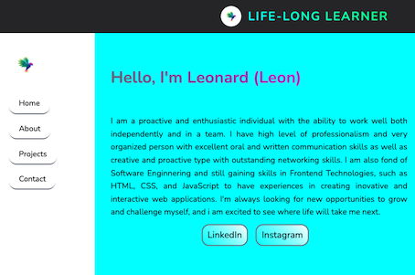
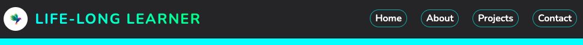
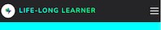
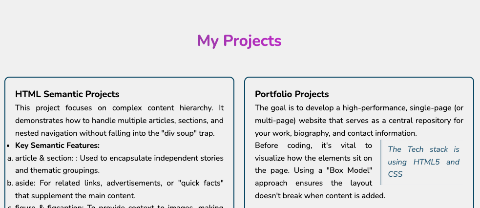
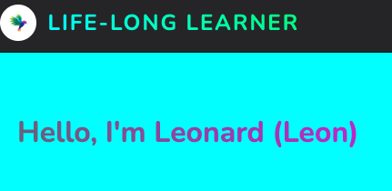
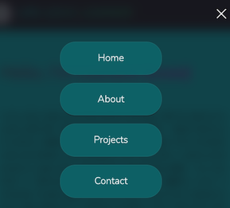

# Leonard Portfolio Website

A clean and professional portfolio website designed to showcase my creative work, technical skills, and professional journey.

---

## 🔗 Live Demo

Check it out here: [https://revou-fsse-feb26.github.io/milestone-1-leogurning/]

---

## 📖 Overview

This website serves as my digital business card. The goal was to create a fast-loading, visually appealing space that provides potential employers or clients with everything they need to know about my work in one place.

---

## ✨ Features

- **About me:** The summary of myself, education background, experiences, and skills.

- **Portfolio:** A list of my projects, showcasing my latest work with clients.
- **Contact Form:** A stylized form for direct inquiries.
- **Sticky/Fixed header:** The sticky/fixed header is designed locked to the top of the browser window from the moment the page loads. This is to keep important links of logo text and other navigation links.
- **Table of work experience:** A table in a website is a way to organize information of work experiences into rows and columns.
- **Social links:** A simple stylized links with absolute destination address to linkedin and instagram.
- **Dropdown input:** A input element for Reason for Contact purpose in the Contact Us form that allows user to choose one value from a pre-defined list. Instead of typing out an answer, user can click the box, and there is a list "drops down" to pick from.
- **Reset button:** A button in the Contact Us form to reset all of input values given.
- **Implementation of `<aside>`, `<figure>`+`<figcaption>`, nested `<article>`:** These are semantic HTML implemented in the website to have clean and more organized Projects information.

- **CSS Box model Implementation:** Every element in CSS is essentially a box. It consists of Margin, Border, Padding, and Content. Using `box-sizing: border-box;` globally to ensure that padding and borders are included in the element's total width and height.
- **CSS Grid Display:** Grid is perfect for the Heading, Aside, Main, and Footer structure. Define `grid-template-areas` to literally name where the "Header" "Aside" "Main/Content" "Footer" should go.
  

- **CSS Flex Display:** Inside the header, use Flexbox for the logo and navigation. Inside the Home/Hero, About, Projects section, also use Flex display and Flex wrap display in Projects to align and adjust items correctly in the layout adaptively.
  

  

  

- **Google Font and Typography:** Implement Google Fonts, typograhy Font with various weight, size, color and multiple colors background (with text fill color and background clip). Also using linear gradient utility to combine several colors and its gradient

  

- **Responsive Design & Media Queries:** This is how to make the site "adaptive.". Define the correct layout for each different screen sizes (mobile, tab, desktop). For Desktop, Aside will be displayed for Side Sticky Navigation. The Hamburger Menu will be displayed only for mobile device screen

- **The Adaptive Navigation Bar:** This is to implement adaptive Navigation bar for Desktop, Tab, Mobile devices.
  1. Only Desktop: the `Aside` is visible on the left, and shows all navigation links.
  2. Tab and Mobile: `Aside` disappear and `Header` Navigation bar will be displayed. Hamburger menu will be displayed only in Mobile.
     

  

  

  

- **Interaction: Pseudo-classes & Selectors:** These allow you to style elements based on their state or position (hover, nth-child). Also use `transform` property to rotate, scale, or move (translate) elements without breaking the document flow.

---

## 🛠️ Technology Used

### HTML5

- **Semantic Markup:** Used elements like `<header>`, `<main>`, `<section>`, `<article>`, `<aside>` and `<footer>` for better SEO and accessibility.

- **Forms:** Implemented native HTML5 validation for the contact section.

### CSS3

- **Grid and Flex Display & CSS:** Utilized simple CSS for creating a good layout of header, Navbar, table and footer.
- **Google Fonts Integration:** Using google fonts to enhance readability.

### JAVASCRIPT

- **JavaScript: The Hamburger Toggle Class:** Instead of manually changing styles in JS, we use a Class to manage the state. The JS simply "toggles" a CSS class (like .active), and CSS handles the visual transition

---

## 🚀 Getting Started

1.  **Clone the repository:**
    `git clone https://github.com/Revou-FSSE-Feb26/milestone-1-leogurning`
2.  **Open the project:**
    Simply open the `index.html` file in any modern web browser.

---

## 📧 Contact

Feel free to reach out if you have any questions or just want to connect!

- **Email:** leogurning@ovi.com
